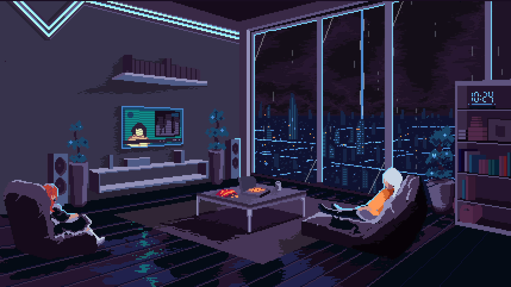
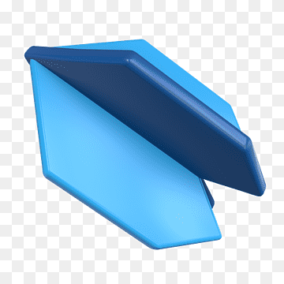

<h3 align="center">A proactive oppurtunist attending college in Chicago, the Windy City</h3>

    

<h1></h1>

<h3 align="center">What I'm About</h3>

 I’m currently working on **ElectroBook** 

 I’m currently learning **flutter and dart**

 I’m looking for help with **internships and oppurtunities**

 How to reach me **vkupp@uic.edu**

<h1></h1>

<h3 align="center">Let's talk</h3>

  
  
  

<h1></h1> 

**LANGUAGES:** 
 

 
  

**LIBRARIES:**
  
  

**DATABASES:**
 
 

**TOOLS:**
 

  

